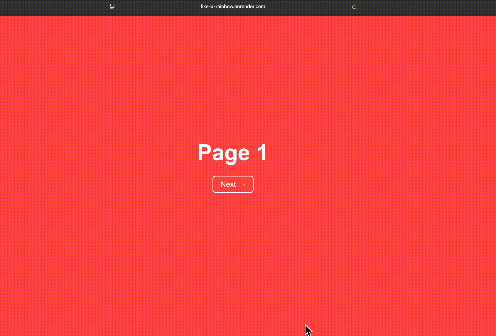

# Like A Rainbow 🎨

### A lightweight Go web application demonstrating clean routing, server side rendering, pagination, and controlled failure simulation in a production hosted environment 💻

## Check out the colors! 👉🏽[Live Demo](https://like-a-rainbow.onrender.com) 🔴🔵🟢🟣

### This project intentionally uses Go's standard library wherever possible to keep the architecture minimal, explicit, and production aligned. 
## Language: Go
## HTTP Server: net/http
## Routing: Chi (github.com/go-chi/chi/v5)
## Templating: html/template

### Simulated Scenarios 📄
#### 

/page/13
Returns 503 Service Unavailable.
#### 

/page/99
 Triggers a runtime panic.

### Demo 🎥

### 🙏 Thanks
#### Hosting and infrastructure provided by Render. Whose platform enables seamless deployment, logging visibility, and automatic service recovery.  